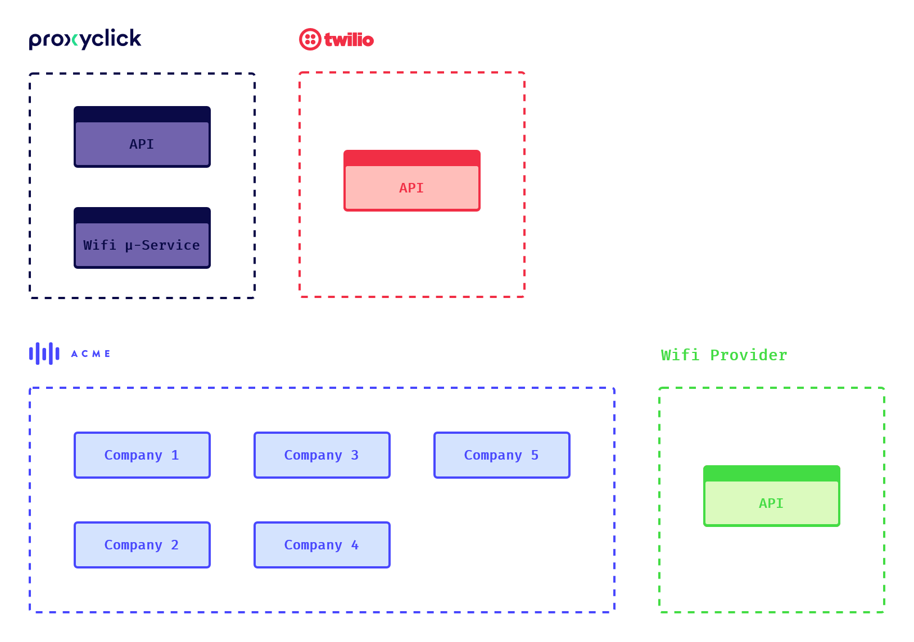
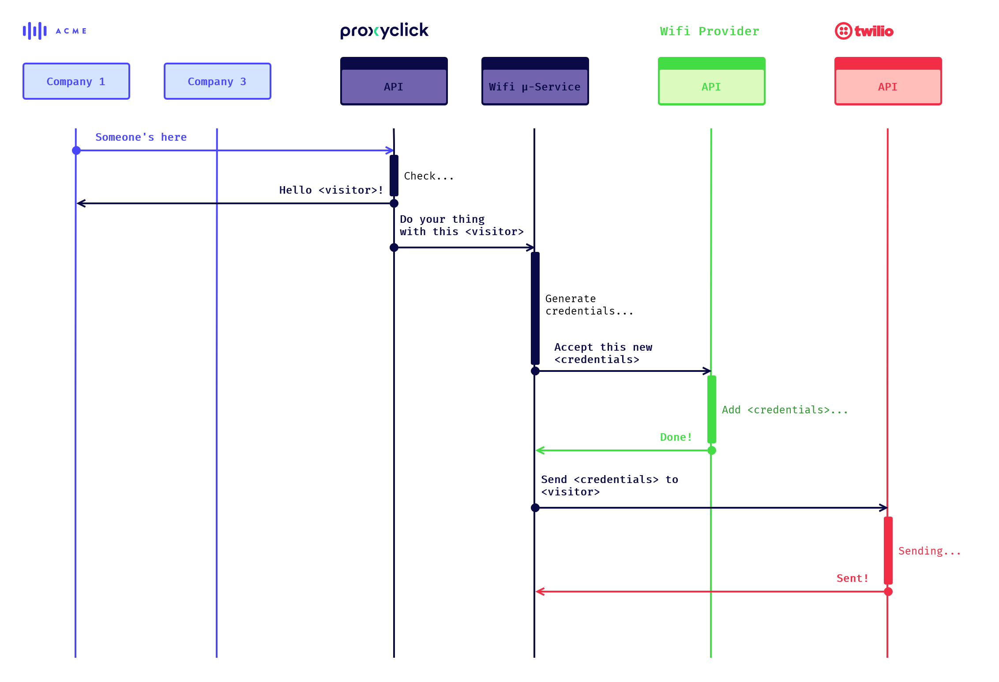
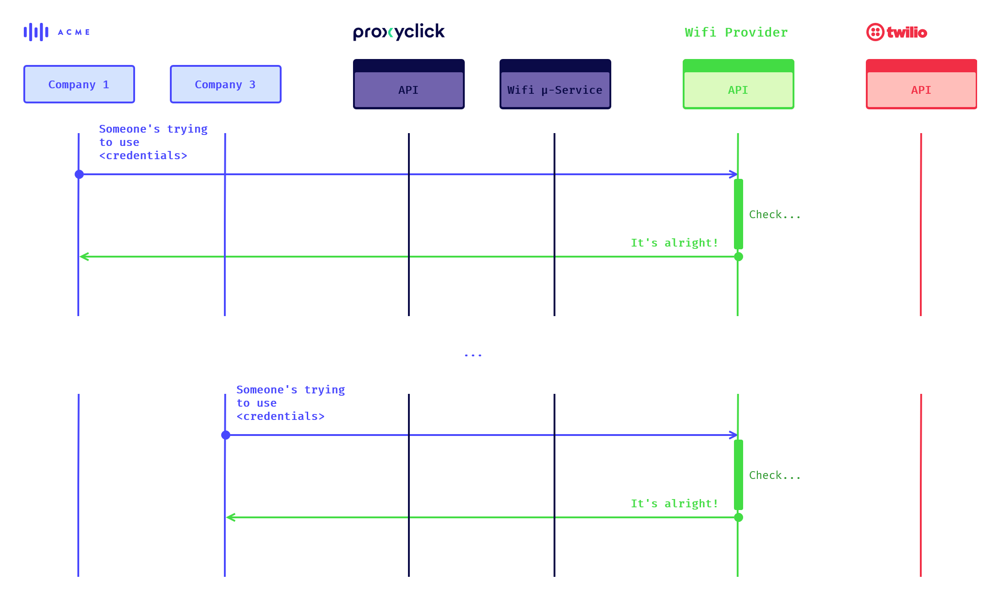
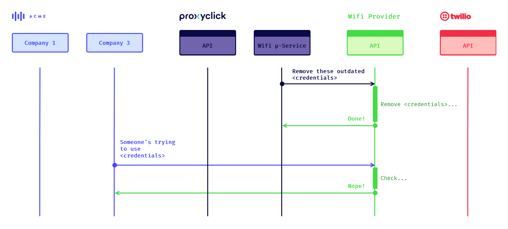

# Proxyclick Wi-fi Credentials Test

> The sales team is forwarding the following customer request to you:
>
> - Our client will have multiple Proxyclick company accounts (around 5)
> - Upon check-in the visitor will receive a text message with the > credentials to use the guest Wi-Fi
> - The credentials are valid for 30 days so that if the visitor visits another office of our customer, they will be able to use to same credentials
>
> Please describe the solution you will put in place using our available building blocks (see https://api.proxyclick.com/v1/docs).
>
> Please reply in a Google doc or similar with logical flow, infrastructure, code and documentation.

## Introduction

Let's suppose the following setup:

- The client "ACME" has 5 distinct companies / sites, all connected to the Proxyclick API with some cutting-edge Aila interactive kiosks
- The client "ACME" has a Wi-fi provider that allows authentication and user management through an API
- Proxyclick has credentials to use "ACME" Wi-fi provider API
- Proxyclick uses a SMS provider, say Twilio (someone's been listening)

The solution would be a **Proxyclick Wi-fi micro-service** that would have the following responsibilities:

- Create `credentials` given a `visitor` object
- Register these `credentials` to the client's Wi-fi provider
- Communicate the `credentials` the `visitor`
- Revoke these `credentials` to the client's Wi-fi provider 30 days after their creation

This micro-service could expose a _webhook_ URL accepting a `visitor`, and could be [written in Node.js](https://github.com/proxyclick/interview-Wi-fi-credentials).

## Credentials creation

Upon arriving, a `visitor` checks in to the kiosk. This triggers an ID check against Proxyclick's database. Assuming the `visitor` is expected and legit, the API responds to the company and triggers the said webhook.

The Wi-fi micro-service then generates `credentials` and asks the Wi-fi provider to register them. If everything goes smoothly, it sends the `visitor` its new `credentials`.

## Credentials usage

The `visitor`, having received its credentials by SMS, can now use the client's Wi-fi in any company / site!

## Credentials revocation

30 days after their creation, the Wi-fi micro-service asks the client's Wi-fi provider do revoke the `credentials`, through a CRON job for instance.

## Notes

As you can see, I didn't explicitly use the Proxyclick API. This is because the API and backend do only two things in this scenario:

1. Check a `visitor`, which is already implemented in embedded kiosk apps
2. Call a webhook, which [seems already possible](https://help.proxyclick.com/visitor-management/webhooks/) and easy enough for Customer Success to do

Having such a micro-service enables to reuse it for other clients that might encounter the same need, rather than having a piece of software making specific calls.

Also, I have now idea how Wi-fi providers work for companies that have multiple sites, except their captive portals have ridiculous user agreements. Being in 2020, I assume some sort of API exists for them, but that may not be the case. Nonetheless, the micro-service could use another service that performs RPC calls / SOAP requests / dark magic if necessary.
